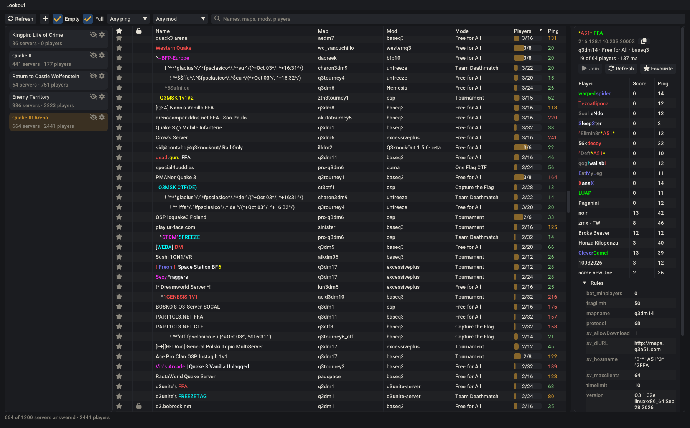

# Lookout

A native Linux game server browser. It lists the servers from each game's masters, filters and sorts them, shows
who is playing, and joins with a double-click through the game's own launcher.



## Games

Lookout knows no game by itself and ships none: each is a description, `games/<key>/game.json`, and each protocol a
Lua script, `protocols/<name>.lua`. The published ones are in [lookout-games](https://github.com/molycode/lookout-games),
which Lookout downloads, updates and removes from Lookout > Download games… (or `lookout --download`), into
`~/.local/share/lookout/downloaded/` (or `$XDG_DATA_HOME/lookout/downloaded/`), checking each file against the
repository's index. Yours go in `~/.local/share/lookout/`, where a description under a downloaded game's key changes
only what it names, so it survives the game's updates. In the app, right-click a game to edit its description, or
click the gamepad beside the "+" to add one; Lookout checks it as you type and reloads the games whenever that folder
changes. `lookout --check <folder>` checks a lookout-games folder before a pull request.

## Building

Needs CMake 4.3 or newer, Ninja, and GCC 14+ or Clang 19+.

```bash
cmake --preset linux-gcc-release
cmake --build --preset linux-gcc-release
./build/gcc-Release/lookout
```

The first configure fetches the submodules and Mbed TLS's release tarball, checked against its published
SHA-256. `tools/build-release.sh` builds the distributable binary in a
container, so that it runs on Ubuntu 22.04, Debian 12 and anything newer. `tools/make-package.sh` then wraps it into
`dist/lookout-<version>-x86_64.tar.xz`, with a menu entry, an icon and an `install.sh` that installs to `~/.local`.

## License

MIT — see `LICENSE`.

Downloads use [Mbed TLS](https://github.com/Mbed-TLS/mbedtls), under the Apache License 2.0. Country data:
[IP Geolocation by DB-IP](https://db-ip.com), under CC BY 4.0. Flags from
[flag-icons](https://github.com/lipis/flag-icons), under the MIT License.

The games' icons are not Lookout's: each comes with an `icon-licence.txt` giving its source and licence, and the games'
names and marks belong to their owners.
